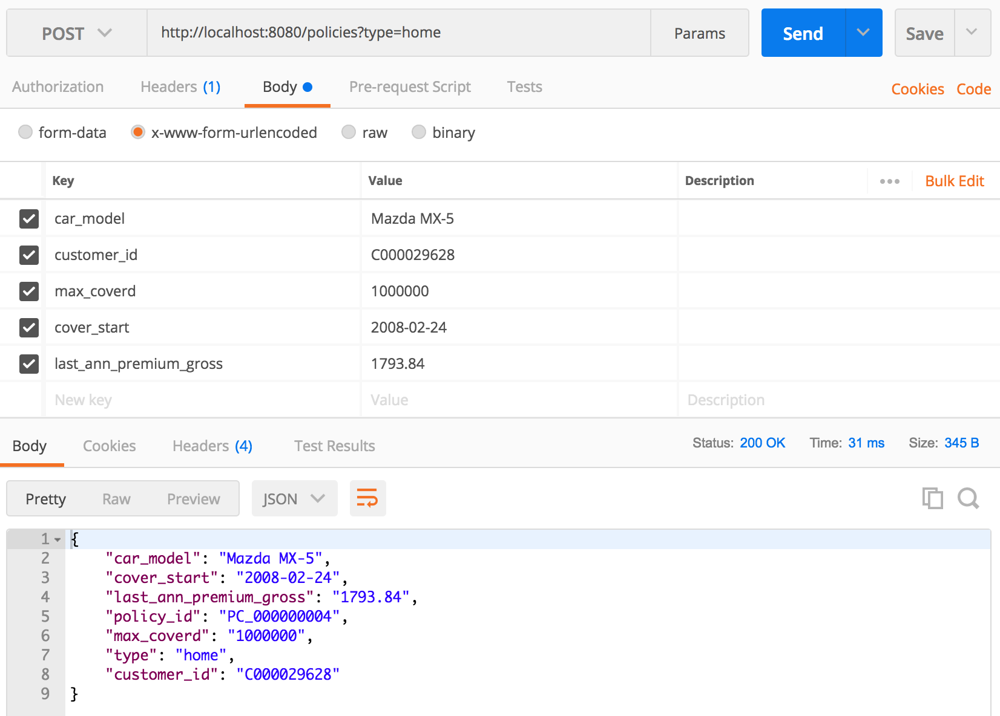
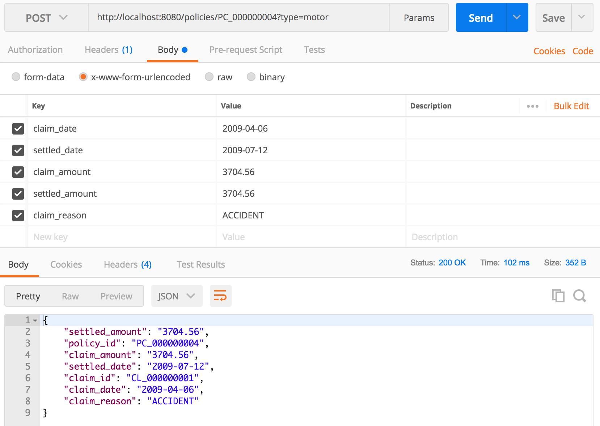

## Options

By default the mainframe simulator will work on the provided sample data directories. The **base** directory contains the actual data of the mainframe, whereas the **cdc** directory contains added insurance policies or claims.

However this can be changed with the following options:

  - **mainframe.repository.base**:: The directory to save the created policies/claims *(default: `sample-data/mainframe`)*
  - **mainframe.repository.cdc**:: The directory to save a copy of the json files for the cdc process *(default: `sample-data/cdc`)* 

Assuming the following configurations are used, the following folder structure will be observed:

- **mainframe.repository.base=/mainframe**
- **mainframe.repository.cdc=/cdc**

```
├── cdc
│   ├── C000000001.json.processed
│   ├── claim
│   │   ├── CL_000000001.json.processed
│   │   └── CL_000000002.json.processed
│   └── policy
│       ├── PC_000000001.json.invalid
│       ├── PC_000000002.json.processed
│       ├── PC_000000003.json.processed
│       ├── PC_000000004.json.processed
│       └── PC_000000005.json.processed
└── mainframe
    ├── claim
    │   ├── CL_000000001.json
    │   └── CL_000000002.json
    └── policy
        ├── PC_000000001.json
        ├── PC_000000002.json
        ├── PC_000000003.json
        ├── PC_000000004.json
        └── PC_000000005.json

6 directories, 15 files

```

## Development mode

You can easily run the application using docker

Notes:
* Assumption is that the first command is executed from the directory `<repo-root>/mainframe_offloading/mainframe-simulator`

```
host$ docker run --rm -it -p 8080:8080 -p 8001:8001 -v $(pwd):/home/app maven:3.5-jdk-8 /bin/bash
container$ cd /home/app
container$ mvn spring-boot:run
```

In case you want to debug run the application with

```
mvn spring-boot:run -Drun.jvmArguments="-Xdebug -Xrunjdwp:transport=dt_socket,server=y,suspend=y,address=8001
```

instead and attach a remote debugger from your IDE.

## Accessing the service

### Get all home insurance policies

Endpoint: `http://localhost:8080/policies?limit=100`. This will return all files under `sample-data/mainframe/policy`.

In order to start with a certain policy for paging purposes, please use the parameter `start` with a certain policy id, e.g. `http://localhost:8080/policies?limit=100&start=PC_000000003`.

### Get one specific insurance policy

Endpoint: `http://localhost:8080/policies/PC_000000001`

### Create a policy

**Note:** The customer has to exist

Endpoint: `http://localhost:8080/policies?type=home`

A sample POST Data will look like this:

```
{
    "car_model": "Mazda MX-5",
    "cover_start": "2008-02-24",
    "last_ann_premium_gross": "1793.84",
    "max_coverd": "1000000",
    "type": "home",
    "customer_id": "C000029628"
}

```

And a reponse will simply be the same document with a policy ID

 ```
 {
    "policy_id": "PC_000000004",
    "car_model": "Mazda MX-5",
    "cover_start": "2008-02-24",
    "last_ann_premium_gross": "1793.84",
    "max_coverd": "1000000",
    "type": "home",
    "customer_id": "C000029628"
}
 
 ```

An example call in Postman:


### Create a claim

**Note:** The customer and the policy has to exist

Endpoint: `http://localhost:8080/policies/PC_000000004?type=motor`

A sample post Data will look like this:

```
{
	"claim_date" : "2009-04-06",
	"settled_date" : "2009-07-12,
	"claim_amount" : 3704.56,
	"settled_amount" : 3704.56,
	"claim_reason" : "COLLISSION"
}

```

And a Return will look like this:

```
{
    "claim_id": "CL_000000001",
	"policy_id": "PC_000000004",
	"claim_date" : "2009-04-06",
	"settled_date" : "2009-07-12,
	"claim_amount" : 3704.56,
	"settled_amount" : 3704.56,
	"claim_reason" : "COLLISSION"
}

```

An example call in Postman:


